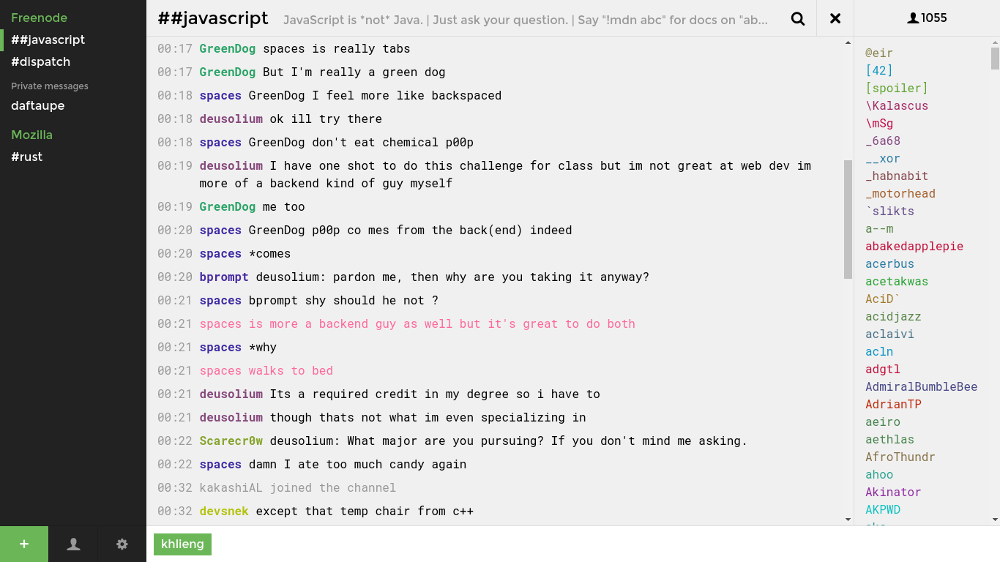

<!--
N.B.: Questo README è stato automaticamente generato da <https://github.com/YunoHost/apps/tree/master/tools/readme_generator>
NON DEVE essere modificato manualmente.
-->

# Dispatch per YunoHost

[](https://dash.yunohost.org/appci/app/dispatch)  

[](https://install-app.yunohost.org/?app=dispatch)

*[Leggi questo README in altre lingue.](./ALL_README.md)*

> *Questo pacchetto ti permette di installare Dispatch su un server YunoHost in modo semplice e veloce.*  
> *Se non hai YunoHost, consulta [la guida](https://yunohost.org/install) per imparare a installarlo.*

## Panoramica

Web-based IRC graphical client


**Versione pubblicata:** 0.7~ynh6

**Prova:** <https://dispatch.khlieng.com/>

## Screenshot



## :red_circle: Anti-funzionalità

- **Applicazione non mantenuta**: Questo software non è più mantenuto. Ci si può aspettare che con il passare del tempo smetta di funzionare, sia esposto a falle di sicurezza, ecc.

## Documentazione e risorse

- Repository upstream del codice dell’app: <https://github.com/khlieng/dispatch>
- Store di YunoHost: <https://apps.yunohost.org/app/dispatch>
- Segnala un problema: <https://github.com/YunoHost-Apps/dispatch_ynh/issues>

## Informazioni per sviluppatori

Si prega di inviare la tua pull request alla [branch di `testing`](https://github.com/YunoHost-Apps/dispatch_ynh/tree/testing).

Per provare la branch di `testing`, si prega di procedere in questo modo:

```bash
sudo yunohost app install https://github.com/YunoHost-Apps/dispatch_ynh/tree/testing --debug
o
sudo yunohost app upgrade dispatch -u https://github.com/YunoHost-Apps/dispatch_ynh/tree/testing --debug
```

**Maggiori informazioni riguardo il pacchetto di quest’app:** <https://yunohost.org/packaging_apps>
